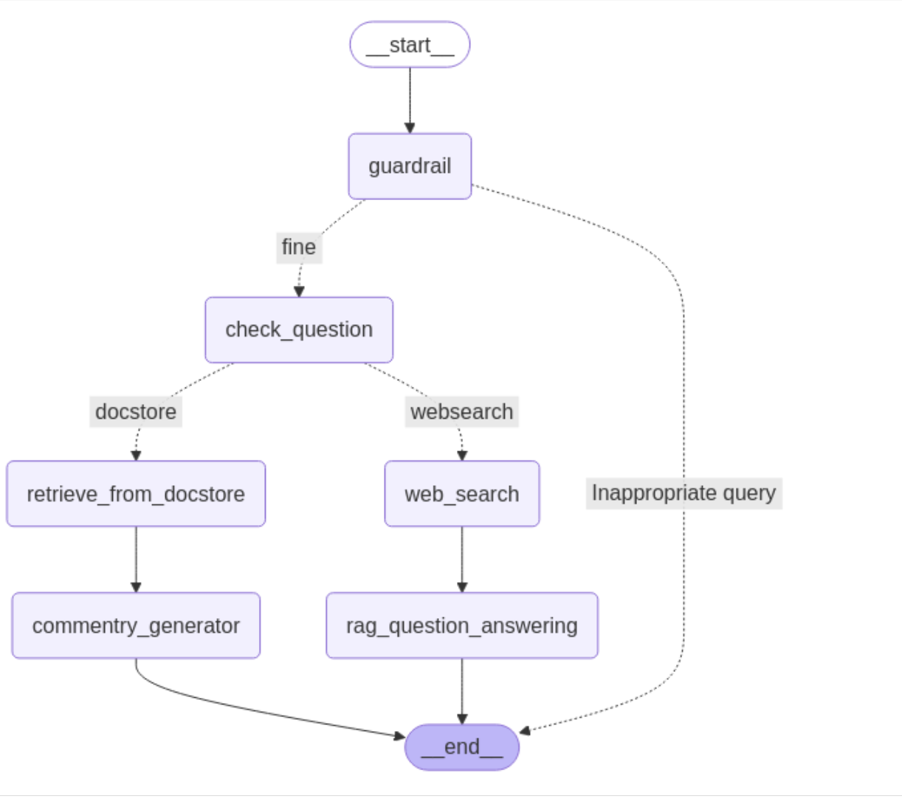

# README: AI Chatbot with Live Commentary and Query Handling

## Overview

This project consists of an AI chatbot designed to handle user queries about live sports commentary and other sports-related information. It integrates two main components:

1. **`run_doc_store.py`**: A background service that continuously scrapes and updates live commentary from a sports website (e.g., Cricbuzz) and stores it in a document store.
2. **`run_langchain.py`**: The primary interface where user queries are processed, classified, and answered using either the live commentary from `doc_store` or web search results.

---

## Features

- **Live Commentary Scraping**: The `doc_store` module fetches live match commentary periodically and stores it for retrieval in document store.
- **Query Classification**: The chatbot determines whether the user query pertains to live updates or historical data.
- **Dynamic Query Handling**:
    - For live updates, it retrieves data from the document store by a pathway connector.
    - For historical or statistical queries, it uses web search.
- **Guardrails for Safety**: Ensures user input adheres to predefined policies (e.g., no abusive or harmful content).
- **Natural Language Processing (NLP)**: Rewrites queries for better search optimization and generates detailed answers.

---

## Project Structure

```
├── run_doc_store.py   # Background service for scraping live commentary
├── run_langchain.py   # Main chatbot logic for handling user queries
├── matches/           # Directory to store scraped match generated while scraping matches
├── requirements.txt
├── .env
```

---

## Model Architecture


## Prerequisites

### Environment Setup

1. Python 3.8 or higher
2. Install required Python libraries:

```bash
pip install -r requirements.txt
```

Example dependencies include:
    - `requests`
    - `beautifulsoup4`
    - `pathway`
    - `pyngrok`
    - `langchain`

### API Keys

- Set up environment variables for required API keys and update in .env:

```bash
PATHWAY_PORT
PATHWAY_PORT2
GEMINI_API_KEY
SERPER_API_KEY
PUBLIC_URL_1 #created and saved by itself after running  doc_store.py
PUBLIC_URL_2 #created and saved by itself after running  doc_store.py
```


---

## Usage

### Step 1: Start the Document Store (`doc_store`)

Run the `run_doc_store.py` script to begin scraping live commentary and hosting the document store server:

```bash
nohup python run_doc_store.py > output.log 2>&1 
```
This saves logs in output.log and run in background.

This script will:

- Scrape live match commentary from Cricbuzz.
- Store the latest updates in a document store.
- Host two servers (on ports PATHWAY_PORT and PATHWAY_PORT2) for retrieving stored data.


### Step 2: Run the Chatbot (`langchain.py`)

Start the chatbot interface by running:

```bash
python run_langchain.py
```

The script will:

1. Accept user queries.
2. Classify the query as either a request for live updates or historical data.
3. Retrieve answers from the document store or perform a web search as needed.
4. Return a detailed response to the user.

---

## How It Works

### Document Store (`run_doc_store.py`)

- **Scraping**: Fetches live commentary from Cricbuzz at regular intervals (default: every 25 seconds).
- **Storage**: Stores scraped data in a structured format for efficient retrieval.
- **Server Hosting**:
    - Hosts two servers using `pyngrok` to expose APIs for retrieving stored documents if localhost doesn't work while fetching urls.


### Chatbot (`run_langchain.py`)

1. **Input Handling**:
    - Accepts user queries via standard input.
2. **Guardrails**:
    - Checks if the input complies with communication policies (e.g., no harmful content).
3. **Query Classification**:
    - Determines if the query is about live updates or historical/statistical data.
4. **Data Retrieval**:
    - For live updates: Queries the document store servers.
    - For other queries: Performs a web search using Google Serper API.
5. **Response Generation**:
    - Uses NLP models (e.g., Gemini) to generate detailed, user-friendly responses.

---

## Configuration

### Modify Scraping Settings

In `run_doc_store.py`, adjust these parameters as needed:

- `website_urls`: List of URLs to scrape (default is Cricbuzz).
- `refresh_interval`: Time interval (in seconds) between successive scrapes.


## Example Interaction

1. Start both scripts (`nohup python run_doc_store.py > output.log 2>&1 ` and `python run_langchain.py`).
2. Enter a query like:

```
Enter user query: What’s the commentary of today’s IPL match?
```

3. The chatbot will classify this as a live update request and fetch data from the document store.

Output example:

```
19.1: Yorker from Bumrah! The batter just digs it out—no run. (Score: 145/6)
19.2: Short ball! Pulled away for a single to deep square. (Score: 146/6)
```

---

## Troubleshooting

### Common Issues
1. **Issues in running pathway locally**:
    - Since Pathway is resource-intensive, it may not run efficiently on your local system. Instead, switch to Google Colab, copy all the necessary files, hardcode the environment variables, and then run the two scripts there.
2. **No Data Retrieved**:
    - Ensure `run_doc_store.py` is running and scraping data successfully.
3. **API Errors**:
    - Verify that API keys are correctly set in environment variables.
4. **Unable to Run on Localhost**:
    - If accessing the local server fails, create a public URL using ngrok.
    
### Setting Up ngrok

If your local server is not accessible which comes up while running in colab, create an ngrok auth token and run the following command in the terminal to set token. This will help create a public url for localhost which can be accessed.

``` python
!ngrok config add-authtoken "your-token"
```

This script first tries to connect to `localhost`. If it fails, it creates a public URL using ngrok. Make sure your NGROK_AUTH_TOKEN is set in your environment variables before running the script.

